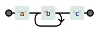
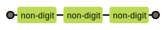
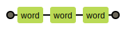
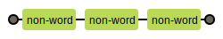
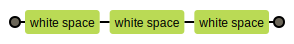
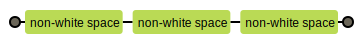

# Regular Expressions
- Formally, a regular expression is an **algebraic notation** for characterizing a set of strings.
- Useful for searching in texts, we have:
  - A pattern to search for
  - And a corpus of texts to search through.
- They are case sensitive.
- Regular expressions always match the largest string they can -> Greedy
- we will use the online tool [RegEx Pal](https://www.regexpal.com/) for testing our regular expressions.
- You can use this [dummy text](https://www.lipsum.com/) for testing.

>> Note: we may show some regular expressions delimited by slashes but slashes are not part of the regular expressions.

>> Note: We can set a flag to ignore the case.

## Simple text
- **String**: Typing a string of characters will match that string.
    - E.g.: `mostafa` will match every `mostafa` in the passage.
- **Single Character**: Typing a solo characters will match that characters.
    - E.g.: `!` will match every `!` in the passage.
## Disjunction
- **Disjunction**: Typing characters enclosed by square brackets `[]` to match any of the characters from this list.
    - 
    - E.g.: `[hH]ello` will match every `hello` or `Hello` in the passage.
    - E.g.: `[mM]ostafa` will match every `mostafa` or `Mostafa` in the passage.
## Range
- **Range**: Typing a range of characters enclosed by square brackets `[]` and separated by dashes `-` to match any of the characters from this range.
    - E.g.: `[a-c]ello` will match every `aello`, `bello`, `cello` in the passage.
    - E.g.: `[0-9]ello` will match every `0ello`, `1ello`, `2ello`, `3ello`, `4ello`, `5ello`, `6ello`, `7ello`, `8ello`, `9ello` in the passage.
## Caret
-  **Caret**: The square braces can also be used to specify what a single character cannot be, by use of the caret `^`.
   - If the caret `^` is the first symbol after the open square brace `[`, the resulting pattern is negated.
   - E.g.: `[^a]` will match any single character (including special characters) except `a`.
   - 
   - E.g.: `[^A-Z]` will match every character that is not a capital letter.
   - E.g.: `[^0-9]` will match every character that is not a number.
   - E.g.: `a[^0-9]b` will match every `a` followed by a character that is not a number and then a `b`.
   - 
   - This is only true when the caret is the first symbol after the open square brace. If it occurs anywhere else, it usually stands for a caret.
   - E.g.: `a^b` will match every `a^b`.
## Quantifiers
- **Question Mark**: The `?` indicates **zero** or **one** occurrences of the **preceding** element. 
  - 
  - E.g.: `colou?r` matches both `color` and `colour`.
- **Asterisk**: The `*` indicates **zero** or **more** occurrences of the **preceding** element. 
  - 
  - E.g.: `ab*c` matches `ac`, `abc`, `abbc`, `abbbc`, and so on.
- **Plus Sign**: The `+` indicates **one** or **more** occurrences of the **preceding** element. 
  - 
  - E.g.: `ab+c` matches `abc`, `abbc`, `abbbc`, and so on, but not `ac`.
- **{n}**: The **preceding** item is matched **exactly n** times.
  - 
  - E.g.: `ab{2}c` matches `abbc`.
- **{min,}**: The **preceding** item is matched **min** or **more** times.
  - 
  - E.g.: `ab{2,}c` matches `abbc`, `abbbc`, `abbbbc`, and so on.
- **{,max}**: The **preceding** item is matched **max** or **less** times.
  - E.g.: `ab{,2}c` matches `ac`, `abc`, `abbc`.
- **{min,max}**: The **preceding** item is matched at **between min and max** times.
  - 
  - E.g.: `NLP{3,5}` matches `NLPPP`, `NLPPPP`, `NLPPPPP` ,but not `NLP` or `NLPP`.
## Wildcard & Anchors
- **Dot**: The `.` matches any single character except the newline character `\n`.
  - E.g.: `a.c` matches `abc`, `a c`, `a1c`, `a-c`, and so on.
  - E.g.: `.{5}` matches any five-character string.
  - E.g.: `.*Mostafa*.` matches any string with `Mostafa` as a sub-string.
  - E.g.: `Mostafa.*Wael` matches any string that starts with `Mostafa` and ends with `Wael` (in the same line).
>> a “word” for the purposes of a regular expression is defined as any sequence of **word characters**: **digits**, **underscores**, or **letters**
- **Anchors**: Doesn't match characters, rather they assert conditions about the string. 
  - **Caret**: The `^` matches the **beginning** of a **string** or a **new line** if the multiline flag is on.
    - E.g.: `^a` matches `a` in `abc`, but not `a` in `bac`.
  - **Dollar Sign**: The `$` matches the **end** of a **string** or a **line** if the multiline flag is on.
    - E.g.: `a$` matches `a` in `bca`, but not `a` in `abc` or `bac`.
  - **Word Boundary**: The `\b` matches a **word boundary** which is either a **whitespace** character or the **beginning** or **end** of a string or a **punctuation**.
    - The following three positions are qualified as word boundaries:
      - Before the first character in a string if the first character is a word character.
      - After the last character in a string if the last character is a word character.
      - Between two characters in a string if one is a word character and the other is not.
    - E.g.: The word boundaries in `Mostafa, focus!` are:
      - Before the `M`.
      - After the last `a`.
      - Before the `f`.
      - After the `s` in `focus`.
    - E.g.: `\bMostafa\b` matches `Mostafa` in `Mostafa, focus!`, but not `Mostafa` in `Mostafaaaaa, focus!`.
    - E.g.: `\bWael` matches `Wael` in `mostafa Wael` and `mostafa-Wael`, but not `Wael` in `mostafa_Wael` or `mostafa2Wael` or `mostafaWael`. 
    - E.g.: `\b\d\d:\d\d\b` matches `1:30` in `I wrote this at 01:30 AM`
  - **Non-Word Boundary**: The `\B` matches a **non-word boundary** which is any word character like **digits**, **underscores**, or **letters**.
    - E.g.: `\BWael` matches `Wael` in `mostafa_Wael`, `mostafa2Wael` or `mostafaWael`, but not `Wael` in `mostafa Wael` or `mostafa-Wael`.
## Grouping
- **Pipe Symbol**: The `|` matches either the **preceding** or the **following** element.
  - E.g.: `hobby|ies` matches `hobby` in `my hobby` and `ies` in `hobbies`.
  - 
- **Parenthesis**: The `()` is used for grouping characters together to allow operators to act on them as a group.
  - E.g.: `hobb(y|ies)` matches `hobby` in `my hobby` and `hobbies` in `my hobbies`.
  - .svg)
  - E.g.: `a(bc)+` matches `abc` in `abc`, `abcbc` in `abcbc`, and `abcbcbc` in `abcbcbccc`.
  - +.svg)
### Aliases
- **Aliases**: To save typing for common ranges.
  - **\d**: Expands to `[0-9]` and matches any digit.
    - E.g.: `\d` or `[0-9]` match `0` in `0abc` and `9` in `9abc`.
    - E.g.: `\d\d\d` or `[0-9][0-9][0-9]` match `123` in `123abc`.
    - 
  - **\D**: Expands to `[^0-9]` and matches any non-digit.
    - E.g.: `\D` or `[^0-9]` match `abc` in `0abc5` and `bac` in `9abc8`.
    - E.g.: `\D\D\D` or `[^0-9][^0-9][^0-9]` match `abc` in `123abc`.
    - 
  - **\w**: Expands to `[a-zA-Z0-9_]` and matches any word character(digits, underscores, or letters).
    - E.g.: `\w` or `[a-zA-Z0-9_]` match `ab` and `c` in `ab-c`.
    - 
    - E.g.: `\w\w\w` or `[a-zA-Z0-9_][a-zA-Z0-9_][a-zA-Z0-9_]` match `mos` in `most-tafa`.
    - 
  - **\W**: Expands to `[^a-zA-Z0-9_]` and matches any non-word character(digits, underscores, or letters).
    - E.g.: `\W` or `[^a-zA-Z0-9_]` match `-` in `ab-c`.
    - 
    - E.g.: `\W\W\W` or `[^a-zA-Z0-9_][^a-zA-Z0-9_][^a-zA-Z0-9_]` match `-` in `most---tafa`.
    - 
  - **\s**: Expands to `[ \t\n\r\f\v]` and matches any whitespace/tabs character.
    - E.g.: `\s` or `[ \t\n\r\f\v]` match ` ` in `a b`.
    - E.g.: `\s\s\s` or `[ \t\n\r\f\v][ \t\n\r\f\v][ \t\n\r\f\v]` match `   ` in `a   b`.
    - 
  - **\S**: Expands to `[^ \t\n\r\f\v]` and matches any non-whitespace/tabs character.
    - E.g.: `\S` or `[^ \t\n\r\f\v]` match `a` and `-b` in `a -b`.
    - E.g.: `\S\S\S` or `[^ \t\n\r\f\v][^ \t\n\r\f\v][^ \t\n\r\f\v]` match `Mos` and `afa` in `Mos   afa`.
    - 
  
## Backslash
- **Backslashes**: To refer to characters that are special themselves. 
  - **\\***: Matches the `*`.
  - **\\.**: Matches the `.`.
  - **\\?**: Matches the `?`.
- Or even:
  - **\n**: Matches the newline character.
  - **\t**: Matches the tab character. 

## Simple Example
Write a RegEx to find cases of the English word `the`. We want to get even if it at the beginning of the line or starts with a number. 
1. `the`:
   - 
   - Wrong!
   - Misses `The` with capital `T`.
2. `[tT]he`: 
   - 
   - Wrong!
   - Incorrectly return texts with the embedded in other words.
   - E.g.: `other` or `theology`.
3. `\b[tT]he\b`: 
   - ![\b[tT]he\b](img/_b%5BtT%5Dhe_b.svg)
   - Wrong!
   - Won’t treat underscores and numbers as word boundaries.
   - But, we want to detect sequences as `the_` or `the25`.
4. `[^a-zA-Z][tT]he[^a-zA-Z]`: 
   - 
   - Wrong!
   - Here we specify that we want instances in which there are no alphabetic letters on either side of the but it misses the when it begins a line.
5. `(^|[^a-zA-Z])[tT]he([^a-zA-Z]|$)`:
   - [tT]he([^a-zA-Z]_$).svg)
   - Correct! 
   - By specifying that before the `the` we require either `the` beginning-of-line or a non-alphabetic character, and `the` same at the end of the line. 
   - Problems with consecutive `the`.
## Substitutions
- We can replace a string we have found -or parts of it- with something else.
- E.g.: `s/this/that/` will replace `this` with `that`.
- E.g.: `s/colour/color/` will replace `colour/` with `color/`.
  
## Capturing Groups & Referencing
- Regex stores the captured patterns in memory and they can be called back and forth.
- To do so, we must specify the regex in parentheses `()`.
- E.g.: `CMP([0-9]+)` will capture the number `23` in `CMP 23` and save it in the memory.
- We can call that exact number using a one-based index like this: `CMP([0-9]+) are \1 years old` will match `CMP 23 are 23 years old`.
- E.g.: `The (.*)er they (.*)` will capture `The faster they ran` where `fast` can be accessed using `\1` and `ran` can be accessed using `\2`.
- E.g.: `The (.*)er they (.*), the \1er we \2` will capture `The faster they ran, the faster we ran`.
- This is called a **capturing group**, we can use a **non-capturing group** by adding `?:` before the expression in the parentheses. 
- E.g.: `(?:some|few) (people) like \1` will match `some people like people` and `few people like people`. Where the `\1` will be replaced with `people` not `some` nor `few`, because they are in a **non-capturing group**.
## Types of Errors
- The process we just went through was based on fixing two kinds of errors:
  - **False positives**, strings that we incorrectly **matched** like `other` or `there`.
  - **False negatives**, strings that we incorrectly **missed**, like `The`.
- Reducing the overall error rate for an application thus involves two antagonistic efforts:
  - Increasing **precision** (minimizing false **positives**).
  - Increasing **recall** (minimizing false **negatives**).

## Lookaround Assertions
For performing matches based on information that follows or precedes a pattern, without the information within the lookaround assertion forming part of the returned text → do not consume characters in the string, but only assert whether a match is possible or not (zero-length assertions).
- Types of lookaround assertion:
  - Positive Lookahead `(?=f)` : 
    - .svg)
    - Asserts that what immediately follows the current position in the string is `f`
    - `a(?=b)` will match `a` in `abc` but will not match `a` in `acb` or `bac`.
  - Positive Lookbehind `(?<=f)` : 
    - Asserts that what immediately precedes the current position in the string is `f`
    - `(?<=y)z` will match `z` in `xyz` but will not match `z` in `zyx`.
  - Negative Lookahead `(?!f)` : 
    - .svg)
    - Asserts that what immediately follows the current position in the string is not `f`
    - `a(?!b)` will match `a` in `acb` but will not match `a` in `abc`.
  - Negative Lookbehind `(?<!f)` : 
    - Asserts that what immediately precedes the current position in the string is not `f`
    - `(?<!y)z` will match `z` in `zyx` but will not match `z` in `xyz`.
  - >> we used `!` instead of `=` in the -ve expressions. 

## Simple Example
Write a RegEx to concatenate sperate digits. E.g.: `2 3` be `23`, ...

Answer:  `s/(?=\d)\s+(?<=\d)//`.

Illustration:
- To replace `x` with `y`: `s/x/y/`
- To remove `x`: `s/x//`
- We want to select everyspace(s) that is bounded by two digits:
  - Should be precceded by a digit: `(?=\d)`.
  - Followed by a digit: `(?<=\d)`.
  - Any number of spaces: `\s+`.

>> Diagrams made with [Regex Pal](https://www.regexpal.com/).
